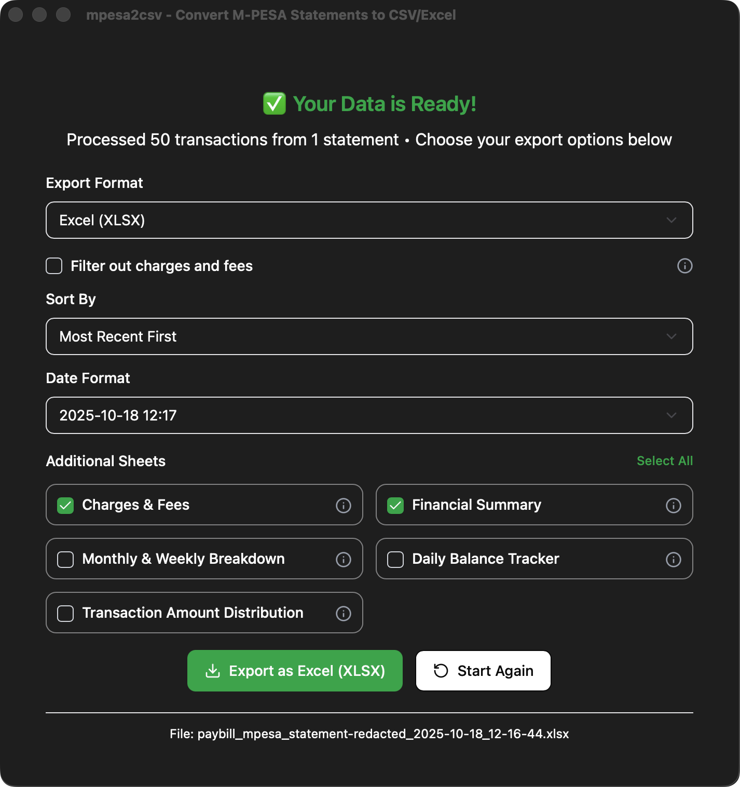

<div align="center">
  
  
  # mpesa2csv
  
  **Convert M-PESA Statement PDFs to CSV/Excel with Advanced Analytics**
  
  [](https://github.com/DavidAmunga/mpesa2csv/releases)
  [](https://opensource.org/licenses/MIT)
  [](https://github.com/DavidAmunga/mpesa2csv/releases)
  [](https://github.com/DavidAmunga/mpesa2csv/releases)
  [](https://github.com/DavidAmunga/mpesa2csv/blob/main/CONTRIBUTING.md)
  [](https://tauri.app/)
  
  A desktop application built with Tauri, React, and TypeScript that converts M-PESA statement PDFs to CSV/Excel files with comprehensive financial analytics.
  
  [Download](https://github.com/DavidAmunga/mpesa2csv/releases) • [Features](#features) • [Documentation](#usage) • [Contributing](CONTRIBUTING.md)
  
</div>

<div align="center">

</div>

---

## Features

### Core Functionality

- **PDF Conversion** - Extract M-PESA statement data with high accuracy using Tabula
- **Password-Protected PDFs** - Seamlessly handle encrypted PDF files
- **Multiple Export Formats** - Export to CSV, Excel (XLSX), JSON, OFX, QFX, or QIF
- **Paybill Statement Support** - Full support for both regular and paybill M-PESA statements
- **Webhook Integration** - Send data directly to external APIs with custom headers

### Export Formats

- **CSV** - Clean output with UTF-8 BOM encoding for Excel/Google Sheets
- **Excel (XLSX)** - Professional formatting with multiple optional analysis sheets
- **JSON** - Structured data for developers and custom integrations
- **OFX/QFX** - Experimental support for accounting software (Quicken, QuickBooks)
- **QIF** - Experimental support for legacy financial applications
- **Webhook/API** - Direct integration with external services

### Advanced Analytics & Reports

When exporting to Excel, optionally include:

- **Money In Sheet** - All transactions where money was received, with totals
- **Money Out Sheet** - All transactions where money was spent, with totals
- **Charges & Fees Sheet** - Separate breakdown of all transaction charges and fees
- **Financial Summary** - Comprehensive analysis with cash flow, spending patterns, and insights
- **Monthly & Weekly Breakdown** - Pivot-like tables with time-based aggregations
- **Daily Balance Tracker** - Day-by-day balance monitoring with spending pattern analysis
- **Transaction Amount Distribution** - Categorized transaction analysis by amount ranges
- **Top Contacts** - Top 20 people/entities you transact with most frequently

### Smart Filtering

- **Date Range Filters** - Export specific time periods
- **Transaction Type Filters** - Filter by transaction categories (payments, withdrawals, deposits, etc.)
- **Amount Range Filters** - Focus on transactions within specific amount ranges
- **Custom Date Formatting** - Choose your preferred date format for exports

### Privacy & Performance

- **100% Local Processing** - Your statements never leave your computer
- **Fast & Efficient** - Powered by Tabula for accurate PDF table extraction
- **Modern UI** - Beautiful, intuitive interface with theme support
- **Auto-Updates** - Stay up-to-date with the latest features automatically

## Installation

### Pre-built Binaries

Download the latest release for your operating system from the [Releases](https://github.com/DavidAmunga/mpesa2csv/releases) page:

| Platform    | Download                                 |
| ----------- | ---------------------------------------- |
| **Windows** | `.exe` installer                         |
| **macOS**   | `.dmg` file (Intel & Apple Silicon)      |
| **Linux**   | `.AppImage` (portable) or `.deb` package |

### Auto-Updates

The application includes automatic update functionality. When a new version is available, you'll be prompted to update directly from within the app.

## Usage

1. **Launch** the application
2. **Select** your M-PESA statement PDF by clicking "Select PDF File" or drag and drop
3. **Enter password** (if your PDF is password-protected)
4. **Choose export options**:
   - Select format (CSV or Excel)
   - Choose additional sheets for Excel export
   - Apply filters (date range, transaction types, amounts)
   - Select date format
5. **Process** the statement - the app will extract and analyze your data
6. **Download** your converted file with a single click
7. **Open** the file directly from the success notification

## Development

### Prerequisites

- [Node.js](https://nodejs.org/) (v18 or newer)
- [Rust](https://www.rust-lang.org/tools/install) (v1.70 or newer)
- [pnpm](https://pnpm.io/) (v10 or newer)
- [Java JRE](https://www.oracle.com/java/technologies/downloads/) (for Tabula - automatically set up)

### Technology Stack

- **Framework**: [Tauri v2](https://tauri.app/) - Cross-platform desktop application framework
- **Frontend**: [React](https://reactjs.org/) + [TypeScript](https://www.typescriptlang.org/)
- **Styling**: [Tailwind CSS](https://tailwindcss.com/) + [Radix UI](https://www.radix-ui.com/)
- **PDF Processing**: [Tabula](https://tabula.technology/) - Java-based PDF table extraction
- **Excel Generation**: [ExcelJS](https://github.com/exceljs/exceljs)
- **CSV Generation**: [PapaParse](https://www.papaparse.com/)

### Building from Source

1. **Clone the repository**

   ```bash
   git clone https://github.com/DavidAmunga/mpesa2csv.git
   cd mpesa2csv/app
   ```

2. **Install dependencies**

   ```bash
   pnpm install
   ```

3. **Set up build JRE** (automatic during build)

   ```bash
   pnpm run setup-jre
   ```

4. **Run in development mode**

   ```bash
   pnpm run tauri:dev
   ```

5. **Build for production**
   ```bash
   pnpm run tauri:build
   ```

### Available Scripts

```bash
pnpm run dev              # Run Vite dev server
pnpm run build            # Build frontend
pnpm run tauri:dev        # Run Tauri in development mode
pnpm run tauri:build      # Build production app
pnpm run tauri:build:full # Build with full JRE (not minimal)
pnpm run setup-jre        # Set up build JRE for Tabula
```

## Contributing

We welcome contributions! Whether it's bug reports, feature requests, or code contributions, we appreciate your help in making mpesa2csv better.

### Quick Start for Contributors

1. Fork the repository
2. Create a feature branch: `git checkout -b feat/your-feature-name`
3. Make your changes and test locally
4. Submit a pull request using our [PR template](.github/pull_request_template.md)

Please read our [Contributing Guidelines](CONTRIBUTING.md) for more details.

## Changelog

See [CHANGELOG.md](CHANGELOG.md) for a detailed list of changes in each version.

## Privacy Notice

**Your privacy is our priority.** This application processes all data locally on your device. No data is sent to any external servers. Your M-PESA statements remain completely private and secure on your computer.

## License

This project is licensed under the MIT License - see the [LICENSE](LICENSE) file for details.

## Acknowledgements

- [M-PESA](https://www.safaricom.co.ke/personal/m-pesa) by Safaricom
- [Tabula](https://tabula.technology/) - PDF table extraction
- [Tauri](https://tauri.app/) - Desktop application framework
- All our [contributors](https://github.com/DavidAmunga/mpesa2csv/graphs/contributors)

## Star History

If you find this project useful, please consider giving it a star

---

<div align="center">
  Made with ❤️ by <a href="https://davidamunga.com">David Amunga</a>
</div>
